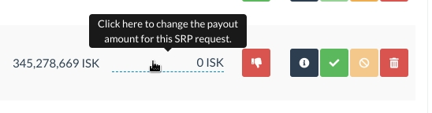

# Change Log

All notable changes to this project will be documented in this file.

The format is based on [Keep a Changelog](http://keepachangelog.com/)
and this project adheres to [Semantic Versioning](http://semver.org/)


## [In Development] - Unreleased


## [1.16.1] - 2022-08-06

### Update Information

**This release includes all changes from
[1.16.0 (YANKED)](https://github.com/ppfeufer/aa-srp/releases/tag/v1.16.0) as well
as the following:**

If you already installed v1.16.0 and successfully ran migrations, please run the
following command **before** updating to this version.

```shell
python manage.py migrate aasrp 0006
```

This will re-set your migrations to the state of v1.15.2, and you can update as you
would normally do from here.

If you haven't installed v1.16.0 yet, you can just update as usual.

### Fixed

- Migration error for MySQL8 (`django.db.utils.OperationalError: (1292, "Incorrect
  datetime value: '0000-00-00 00:00:00' for column 'comment_time' at row 1")`)
  Thanks to Rhaven (on AA support Discord) for reporting and testing this

### Removed

- Python 3.11 from tests. AA is not tested yet with it, and it's not even stable at
  the moment.


## [1.16.0] - 2022-08-04 [YANKED]

**This release has been yanked from Pypi due to a migration error on systems with
mySQL8**

### Added

- Comment field for accepting SRP requests. This is optional when pending requests
  are accepted, but mandatory when formerly rejected requests are accepted to
  state a reason.
- Request history to request information window

### Changed

- RGB notations in CSS files modernised
- Bottom border colour for changeable payout value for SRP requests that have been
  rejected. Now it's not that prominent anymore and doesn't look like a pending SRP
  request
- Modal window handling improved
- JS and CSS moved to bundled HTML templates
- Minumum requirements
  - allianceauth>=2.15.1
  - allianceauth-app-utils>=1.14.0
  - django-eveuniverse>=0.16.3

### Removed

- Unused JavaScript
- Deprecated `type` attribute from `script` tags
- Deprecated `type` attribute from `style` tags
- Tests for non-stable version of Alliance Auth


## [1.15.2] - 2022-07-21

### Added

- Tooltip to make it a bit more obvious that SRP payout values can be changed ([#72](https://github.com/ppfeufer/aa-srp/issues/72))

  

### Changed

- Moved SRP recalculation to its own function
- Highlight colour for SRP amount changed


## [1.15.1] - 2022-07-11

### Fixed

- JS order in template


## [1.15.0] - 2022-07-11

### Fixed

- Removed a sneaky `'` in a modal template

### Changed

- Switched to the new notification API
- Using bundled `filterDropDown` JavaScript
- Ajax render template moved to a more logical place
- `x-editable` lib moved to a bundled template
- `x-editable` lib updated to v1.5.3

### Removed

- Unnecessary `` statements from templates
- Unnecessary `` statements from templates
- Unused JavaScripts and CSS


## [1.14.0] - 2022-06-18

### Cleanup

- Grammar in comments fixed
- Commented and no longer used code removed
- Code cleaned up in general

### Changed

- Always serve JS and CSS locally (GDPR)
- Functions to check if an additional module is installed have been renamed to
  something that makes more sense
- Optimized notification helper to send Discord messages
- Minimum requirements
  - Python (>= 3.8)


## [1.13.4] - 2022-06-14

### Fixed

- Notifications to Discord when using `allianceauth-discordbot`


## [1.13.3] - 2022-06-05

### Fixed

- AttributeError exception in `get_main_character_from_user` when the user doesn't
  have a main character anymore
- Possible RelatedObjectDoesNotExist error in `get_main_for_character`
- Possible RelatedObjectDoesNotExist error in `get_user_for_character`

### Changed

- Logic for Discord PMs changed/optimized. We now check if the user has a
  Discord account registered with Alliance Auth first, so we don't have to do all
  the other checks if the user doesn't


## [1.13.2] - 2022-05-18

### Fixed

- EveCharacter has no userprofile (#62)

### Changed

- HTML for ajax call result moved to its own template


## [1.13.1] - 2022-03-06

### Fixed

- Reverted JS arrow function back to a normal function, since we need `$(this)` here


## [1.13.0] - 2022-03-02

### Added

- Test suite for AA 3.x and Django 4

### Changed

- Switched to `setup.cfg` as config file, since `setup.py` is deprecated now

### Removed

- Deprecated settings


## [1.12.0] - 2022-02-28

### Fixed

- [Compatibility] AA 3.x / Django 4 :: ImportError: cannot import name
  'ugettext_lazy' from 'django.utils.translation'


## [1.11.2] - 2022-02-26

### Fixed

- Modal windows


## [1.11.1] - 2022-02-25

### Added

- More logging to the Discord message logic

### Fixed

- Enable editable SRP amount field only for pending and rejected requests (#51)
- CSS classes in templates
- Only count approved SRP requests towards the total SRP costs

### Changed

- JavaScript modernised


## [1.11.0] - 2022-02-02

### Changed

- `models.TextChoices` refactored for better code readability
- Using `path` in URL config instead of soon-to-be removed `url`

### Removed

- Outdated management commands. By now everyone should have updated to a version
  where they are no longer needed. No one should have a version that's older than a
  year ...


## [1.10.3] - 2022-01-24

### Fixed

- Don't try to get a character name from a deleted user account. There is none.

### Changed

- Try harder with the Discord messages. (`discordproxy` is the prioritised way to
  send messages to Discord, but if anything fails with it, always try for
  `allianceauth-discordbot` to get the message out)


## [1.10.2] - 2022-01-22

### Added

- Better handling for Discord messages (Prioritise `discordproxy` over
  `allianceauth-discordbot` when both are installed)
- Embedded Discord messages to the SRP team channel, when `discordproxy` is installed

### Fixed

- Import from a module that might not even be there at all, which could have
  resulted in Discord PMs not being delivered


## [1.10.1] - 2022-01-21

### Added

- Access tests

### Changed

- Some minor code optimisations

### Fixed

- Access for users with `manage_srp_requests`


## [1.10.0] - 2022-01-12

### Added

- Discord PMs on SRP accept/reject when `discordproxy` is installed as stand-alone,
  without `aa-discordnotify`

### Changed

- JavaScript: `const` instead of `let` where ever appropriate
- Minimum requirements
  - Alliance Auth v2.9.4


## [1.9.0] - 2022-01-02

### Added

- Workaround for possible bug in AA-Discordbot (#41)

### Changed

- General code cleanup and modernisation
- Switched to Alliance Auth App Utils for some helper functions

### Removed

- Non used code

## [1.8.0] - 2021-11-30

### Changed

- Minimum requirements
  - Python 3.7
  - Alliance Auth v2.9.3


## [1.7.4] - 2021-11-16

### Fixed

- AttributeError ('NoneType' object has no attribute 'id') when, for whatever reason,
  the ship type has been removed from the `EveType` table

### Added

- Versioned static files to prevent browser cache related errors on app updates

### Changed

- Minimum requirements for:
  - Alliance Auth (>= 2.9.0)
  - Django Eveuniverse (>= 0.8.2)
  - Python (>= 3.7)


## [1.7.3] - 2021-10-27

### Fixed

- AttributeError: Resource Killmails not found. Available resources: Alliance,
  Character, Corporation, Universe. This was caused by using AA's ESI provider,
  which has changed. We now use our own ESI provider for everything ESI related.
- Get the sentry username when a creator/reviser has been deleted


## [1.7.2] - 2021-08-18

### Changed

- Improved performance by reducing the number of SQL queries


## [1.7.1] - 2021-07-08

### Added

- Checked for compatibility with Python 3.9 and Django 3.2


## [1.7.0] - 2021-07-04

### Added

- [EveTools kill board](https://kb.evetools.org/) as accepted source for SRP
  request kill mails


## [1.6.1] - 2021-07-01

### Changed

- Masked the `@` symbol in additional information text in the Discord message to the
  SRP team to not accidentally ping in case a Discord ping was copied in there


## [1.6.0] - 2021-06-08

### Changed

- Check for valid zKillboard URL is now done completely via regular expressions.


## [1.5.0] - 2021-05-27

### Added

- Insurance information to SRP request details modal (Only for new SRP requests)


## [1.4.2] - 2021-05-06

### Fixed

- Autocomplete from date/time field removed, so the datepicker works again properly


## [1.4.1] - 2021-05-05

### Fixed

- Using Django application registry instead of directly accessing `INSTALLED_APPS`


## [1.4.0] - 2021-04-20

### Fixed

- IndexError on invalid kill mail link

### Changed

- Forms now using form generation via django-bootstrap-form instead of own template
  construct that was falling apart already


## [1.3.3] - 2020-04-13

### Fixed

- Permission decorators (#22)

### Changed

- Using regular expression to determine if we are looking at a kill mail link or not


## [1.3.2] - 2021-04-06

### Changed

- Required field hint in forms has now its own template since it is not needed in
  every form, to avoid confusion

### Fixed

- Copy to clipboard should only be available for active SRP links


## [1.3.1] - 2021-03-26

### Fixed

- `exception=IndexError('list index out of range')` for Discord notifications on new
  SRP request


## [1.3.0] - 2021-03-26

### Added

- Copy to clipboard for SRP link in SRP dashboard view
- Copy to clipboard for pilot name in SRP link view


## [1.2.2] - 2021-03-14

### Changed

- Notification functions moved to its own module to avoid code duplications


## [1.2.1] - 2021-03-14

### Fixed

- SRP cost info bar removed from user settings tab


## [1.2.0] - 2021-03-14

### Added

- Option for users to disable notifications for this module. When enabled, no
  notifications will be sent at all. Neither in AA itself nor on Discord (if any of
  the Discord apps is active)
- Check if [AA Discord Notify](https://gitlab.com/ErikKalkoken/aa-discordnotify) is
  installed, which picks up on notifications in Auth and relays them to the
  respective user as Discord PM. This way we don't send double notifications to the
  user if [AA-Discordbot](https://github.com/pvyParts/allianceauth-discordbot) is
  installed as well.

### Changed

- Enabled paging for SRP link table on dashboard in "View All" mode


## [1.1.0] - 2021-03-02

### Added

- Option to notify the SRP team in their Discord channels about new SRP requests. (You
  need to have [AA-Discordbot](https://github.com/pvyParts/allianceauth-discordbot)
  installed and configured to use this option)


## [1.0.1] - 2021-02-09

### Fixed

- Discord PM on approval or reject goes to the reviewer instead of the requester (#11)


## [1.0.0] - 2021-02-06

This has now been tested long enough by my corp, it's time to fully release the
module now, so here we go ...

### Important

**If you are updating from an earlier beta-version, please make sure to read through
this changelog, beginning from the beta-version you were using. You might have to do
some manual work, so please update step by step.**

### Fixed

- An issue where too many notifications where created on request accept

### Added

- More details to notifications
- Discord notification via PM to the user on SRP request approval or rejection, if
  [AA-Discordbot](https://github.com/pvyParts/allianceauth-discordbot) is installed


## [0.1.0-beta.16] - 2021-02-06

### Changed

- Migrated SRP request comments (Additional request information and reject information)
  into their own model


## Important Update Instructions

**IMPORTANT**

If you update from v0.1.0-beta.15 or earlier, make sure to read carefully.

In this version the way the SRP request comments are handled has changed. It is no
longer just a simple string in the database table, it is now a proper model. So
you have to an extra steps to migrate your data.

**This needs to be done right after you have updated AA SRP from a version prior
v0.1.0-beta.16.**

### Migrate SRP request comments

To migrate the comments from SRP requests to their own model, simply run
(Make sure you ran migrations before running this command.)

```shell
python manage.py aasrp_migrate_to_comments
```


## [0.1.0-beta.15] - 2021-02-04

### Fixed

- Modal headers


## [0.1.0-beta.14] - 2021-02-02

### Changed

- Form validation moved to the form model instead of view, so the person
  requesting SRP does not have to restart the whole process again if form validation
  fails
- Form error messages formatted


## [0.1.0-beta.13] - 2021-01-27

### Changed

- EVE/UTC tz handling optimized


## [0.1.0-beta.12] - 2021-01-26

### Fixed

- Panel title for overview panel in SRP requests view
- Missing modal for "Delete SRP Request" re-added

### Added

- SRP request details modal in "Your SRP Requests" tab on dashboard view
- SRP request status to details modal


## [0.1.0-beta.11] - 2021-01-26

### Changed

- Modals separated into their own templates
- Wrapped datatables in responsive div
- Moved useragent to constants
- JS re-organized


## [0.1.0-beta.10] - 2021-01-11

### Added

- Fleet name to overview in SRP link view

### Fixed

- Module call in init file


## [0.1.0-beta.9] - 2021-01-06

### Added

- Mandatory reason on SRP reject
- Type hints to classes and functions


## [0.1.0-beta.8] - 2021-01-06

### Fixed

- Filter dropdowns for character again -.-


## [0.1.0-beta.7] - 2021-01-06

### Fixed

- Character portrait formatting
- zKillboard link with icon in request detail modal
- Filter dropdowns for character


## [0.1.0-beta.6] - 2021-01-05

### Added

- Character portraits and ship icons


## [0.1.0-beta.5] - 2021-01-05

### Changed

- Ship is now a proper EveType model instead of just a string


## Important Update Instructions

**IMPORTANT**

If you update from v0.1.0-beta.4 or earlier, make sure to read carefully.

In this version the way the SRP ship is handled has changed. It is no longer just a
simple string in the database, it is now a proper EveType model. So you have to do
some extra steps to migrate your data.

**This needs to be done right after you have updated AA SRP from a version prior
v0.1.0-beta.5.**

### Step 1 - Install EveUniverse

This should be done automatically with the update, but there is still a bit of
manual work to it. First you need to add the EveUniverse module to your
`INSTALLED_APPS` in your `loca.py`.

- Add `"eveuniverse",` to `INSTALLED_APPS`


### Step 2 - Static collection and migration

Now that EveUniverse is installed, you need to run the static collection and
migration. Don't forget to restart your supervisor afterwards.

```shell
python manage.py collectstatic
```

```shell
python manage.py migrate
```

Restart your supervisor services for Auth

### Step 3 - Import ship information from ESI

This is where the magic happens. You are now ready to import the ship information
from ESI.

```shell
python manage.py aasrp_load_eve
```


### Step 4 - Migrate your SRP data

Now that we have all the needed information, your SRP data needs to be updated. This
is just another simple command.

```shell
python manage.py aasrp_update_db_relations
```


## [0.1.0-beta.4] - 2020-12-28

### Fixed

- Permissions on "Edit AAR Link" view some ajax requests


## [0.1.0-beta.3] - 2020-12-28

- First public beta release
